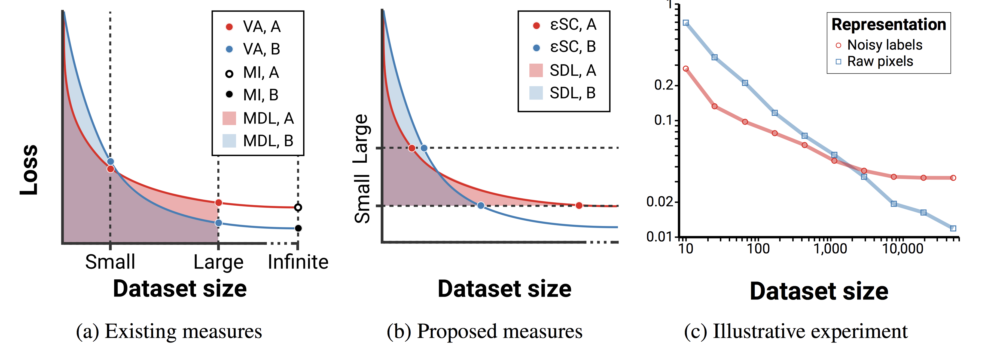

# Reprieve: a library for evaluating representations

Everybody wants to learn good representations of data. However, defining precisely what we mean by a good representation can be tricky. In a recent paper, [Evaluating representations by the complexity of learning low-loss predictors](assets/Evaluating.representations.by.the.complexity.of.learning.low-loss.predictors), we show that many notions of the quality of a representation for a task can be expressed as a function of the _loss-data curve_.



This repo contains a library called `reprieve` (for **repr**esentation **ev**aluation) for computing loss-data curves and the metrics of representation quality that can be derived from them. These metrics are:

- Validation loss
- Mutual information (approximate; a bound only)
- Minimum description length, from [Information-Theoretic Probing with Minimum Description Length](https://arxiv.org/abs/2003.12298)
- Surplus description length (our paper)
- ε-sample complexity (our paper)

We encourage anyone working on representation learning to bring their representations and datasets and use this library for evaluation and benchmarking. Don't settle for evaluating with linear probes or few-shot fine-tuning!

If you run into any problems, please file an issue! I'm happy to help get things working and learn how to make Reprieve better.


## Features

This library is designed to be framework-agnostic and _extremely_ efficient. Loss-data curves, and the associated measures like MDL and SDL, can be expensive to compute as they require training a probe algorithm dozens of times. This library reduces the time it takes to do this from 30 minutes to 2.

- **Bring your own dataset, representation function, and probe algorithm.** We provide implementations of representation functions such as VAEs and supervised pretraining, and an MLP with Adam probe algorithm, but you can quickly and easily use your own.
- **Framework-agnostic.** You can implement representation functions and algorithms in any framework you choose, be it Pytorch, JAX, NumPy, or TensorFlow. Anything that can convert to and from NumPy arrays is fair game.
- **Extremely fast.** When using probing algorithms implemented in JAX, such as the standard MLP example we include, this library performs _parallel training_ of dozens of networks at a time on a single GPU. Loss-data curves derived from training 100 small networks can be computed in about two minutes on one GPU. Yes, training 100 networks at once on one GPU.
- **Publication-ready output.** The library includes utilities for producing publication-quality plots and tables from the results. It even renders LaTeX tables including all the representation metrics.
- **Simple to use.** You can evaluate your representation according to five measures in only a few lines of code.

## Examples

For more examples, see the examples folder. In particular [examples/main.py](examples/main.py) is a complete example using fast parallel training and a JAX algorithm, and [examples/main_torch.py](examples/main_torch.py) is the same example using a Pytorch algorithm and no dependence on JAX.

```python
import torchvision
import reprieve

# import a probing algorithm
from reprieve.algorithms import mlp as alg
from reprieve.representations import mnist_vae


# make a standard MNIST dataset
dataset_mnist = torchvision.datasets.MNIST(
    './data', train=True, download=True,
    transform=torchvision.transforms.Compose([
        torchvision.transforms.ToTensor(),
        torchvision.transforms.Normalize((0.1307,), (0.3081,))]))

# train a VAE on MNIST with an 8D latent space
vae_repr = mnist_vae.build_repr(8)

# make an MLP classifier algorithm with inputs of shape (8,) and 10 classes
# algorithms are represented by an initializer, a training step, and an eval step
init_fn, train_step_fn, eval_fn = alg.make_algorithm((8,), 10)

# construct a LossDataEstimator with this algorithm, dataset, and representation
vae_loss_data_estimator = reprieve.LossDataEstimator(
        init_fn, train_step_fn, eval_fn, dataset_mnist,
        representation_fn=vae_repr)

# compute the loss-data curve
loss_data_df = vae_loss_data_estimator.compute_curve(n_points=10)

# compute all the metrics and render the loss-data curve and a LaTeX table of results
metrics_df = reprieve.compute_metrics(
        loss_data_df, ns=[1000, 10000], epsilons=[0.5, 0.1])
reprieve.render_curve(loss_data_df, save_path='results.pdf')
reprieve.render_latex(metrics_df, save_path='results.tex')
```


## Installation

1. `git clone git@github.com:willwhitney/reprieve.git`
2. Go install the [Dependencies](#dependencies). Since installations of Pytorch and JAX are both highly context-dependent, I won't include an install script.
3. `cd reprieve`
4. `pip install -e .`


### Dependencies

- [Pytorch](https://pytorch.org/get-started/locally/)
- For parallel training: [JAX](https://github.com/google/jax#installation) and [Flax](https://github.com/google/flax#installation). _Strongly_ recommended.
- For generating and saving charts: [Altair](https://altair-viz.github.io/getting_started/installation.html) and [altair_saver](https://github.com/altair-viz/altair_saver/)
        - `pip install altair altair_saver`
- The standard Python data kit, including numpy and pandas.


## Custom representations

### As functions
In Reprieve, representations are structured as functions which transform the observed data. With a dataset `(data_x, data_y)`, a representation will transform batches of `data_x`.

A representation is a function with the following signature:

```
representation_fn: np.ndarray[bsize, *x_shape] -> np.ndarray[bsize, *any]
```

All inputs and outputs to the representation function should be NumPy `ndarray`s. For convenience [`reprieve.representations.common`](reprieve/representations/common.py) contains a function `numpy_wrap_torch` which takes function on Pytorch tensors (such as an `nn.Module`) and returns a function that has `ndarray` inputs and outputs instead.

Note that this representation function should operate on batches of data.

Basically if you do
```python
my_repr_module = MyReprModule()  # some Pytorch nn.Module
my_repr_fn = reprieve.representations.common.numpy_wrap_torch(my_repr_module)
lde = reprieve.LossDataEstimator(alg_init_fn, alg_train_fn, alg_eval_fn, dataset,
representation_fn=my_repr_fn)
```
you'll be all set.

For an example demonstrating this method, see [`reprieve.representations.vae`](reprieve/representations/vae.py).

### As datasets
If in your use case it is simpler to provide a dataset of already-transformed observations, whether as a Pytorch Dataset or as a tuple `(repr_x, data_y)`, you can do that too. For example, you could encode a whole dataset with a VAE, then pass that encoded data `repr_x` to `LossDataEstimator` instead of the original `data_x`.

When doing this simply do not pass an argument for `representation_fn` to LossDataEstimator and it will be left as the identity.

For an example demonstrating this method, see [`reprieve.mnist_noisy_label`](reprieve/mnist_noisy_label.py).


## Algorithms

In reprieve an algorithm is a set of three functions:
1. An `init_fn` which takes a random seed and returns some state object.
2. A `train_step_fn` which takes in the current state and a batch of data `(batch_x, batch_y)` and returns an updated state and the loss on that batch.
3. An `eval_fn` which takes in the current state and a batch of data `(batch_x, batch_y)` and returns only the loss on that batch. Note that `eval_fn` must not mutate the state.


### Built-in algorithms

We include a simple MLP trained with Adam as the default algorithm in reprieve. To use this:

1. `from reprieve.algorithms import mlp as alg` for the JAX version or `from reprieve.algorithms import torch_mlp as alg` for the Pytorch version
2. `init_fn, train_step_fn, eval_fn = alg.make_algorithm(x_shape, n_classes)` where `x_shape` is the shape of a single input to the network and `n_classes` is the number of classes.
3. Pass `init_fn`, `train_step_fn`, and `eval_fn` to LossDataEstimator. If using the JAX version, also pass `vmap=True` for fast performance. If using the Pytorch version you must set `vmap=False` or you will see weird errors.

The code for each of these algorithms is very simple and is meant to be easy to modify to use a different network architecture or optimizer.


### Custom algorithms

Implementing your own algorithm (such as a convolutional probe network or a linear model trained with AdaDelta) is as simple as implementing those three functions. For an example, see the `make_algorithm` function of [reprieve.algorithms.mlp](reprieve/algorithms/mlp.py) (a JAX algorithm) or [reprieve.algorithms.torch_mlp](reprieve/algorithms/torch_mlp.py) (a Pytorch algorithm).

We recommend starting from [reprieve.algorithms.mlp](reprieve/algorithms/mlp.py) and modifying the architecture or optimizer if you are writing your own algorithm.


## Full API documentation

### Class LossDataEstimator

```python
method __init__(self, init_fn, train_step_fn, eval_fn, dataset,
                representation_fn=lambda x: x,
                val_frac=0.1, n_seeds=5,
                train_steps=5e3, batch_size=256,
                cache_data=True, whiten=True,
                use_vmap=True, verbose=False)
```
Create a LossDataEstimator.

Arguments:
- `init_fn`: (function int -> object)
        a function which maps from an integer random seed to an initial
        state for the training algorithm. this initial state will be fed to
        train_step_fn, and the output of train_step_fn will replace it at
        each step.
- `train_step_fn`: (function (object, (ndarray, ndarray)) -> (object, num)
        a function which performs one step of training. in particular,
        should map (state, batch) -> (new_state, loss) where state is
        defined recursively, initialized by init_fn and replaced by
        train_step, and loss is a Python number.
- `eval_fn`: (function (object, (ndarray, ndarray)) -> float)
        a function which takes in a state as produced by init_fn or
        train_step_fn, plus a batch of data, and returns the _mean_ loss
        over points in that batch. should not mutate anything.
- `dataset`: a PyTorch Dataset or tuple (data_x, data_y).
- `representation_fn`: (function ndarray -> ndarray)
        a function which takes in a batch of observations from the dataset,
        given as a numpy array, and gives back an ndarray of transformed
        observations.
- `val_frac`: (float) the fraction of the data in [0, 1] to use for
        validation
- `n_seeds`: (int) how many random seeds to use for estimating each point.
        the seed is used for randomly sampling a subset dataset and for
        initializing the algorithm.
- `train_steps`: (number) how many batches of training to use with the
        algorithm. that is, how many times train_step_fn will be called on
        a batch of data.
- `batch_size`: (int) the size of the batches used for training and eval
- `cache_data`: (bool) whether to cache the entire dataset in memory.
        setting this to True will greatly improve performance by only
        computing the representation once for each point in the dataset
- `whiten`: (bool) whether to normalize the dataset's Xs to have zero
        mean and unit variance
- `use_vmap`: (bool) *only for JAX algorithms*. parallelize the training
        of <algorithm> by using JAX's vmap function. may cause CUDA out of
        memory errors; if this happens, call compute_curve with fewer
        points at a time or use a smaller probe
- `verbose`: (bool) print out informative messages and results as we get
        them

```python
method LossDataEstimator.compute_curve(self, n_points=10, sampling_type='log', points=None)
```
Computes the loss-data curve for the given algorithm and dataset.

Arguments:
- `n_points`: (int) the number of points at which the loss will be
        computed to estimate the curve
- `sampling_type`: (str) how to distribute the n_points between 0 and
        len(dataset). valid options are 'log' (np.logspace) or 'linear'
        (np.linspace).
- `points`: (list of ints) manually specify the exact points at which to
        estimate the loss.
Returns: the current DataFrame containing the loss-data curve.
Effects: This LossDataEstimator instance will record the results of the
        experiments which are run, including them in the results DataFrame
        and using them to compute representation quality measures.

```python
method LossDataEstimator.refine_esc(self, epsilon, precision, parallelism=10)
```
Runs experiments to refine an estimate of epsilon sample complexity.
Performs experiments until the gap between an upper and lower bound is
at most `precision`. This method is implemented as an iterative grid
search.

Arguments:
- `epsilon`: (num) the tolerance specifying the maximum acceptable loss
        from running algorithm on dataset.
- `precision`: (num) how tightly to bound eSC, in terms of
        number of training points required to reach loss `epsilon`. that is, the
        desired `upper_bound - lower_bound`
- `parallelism`: (int) the number of experiments to run in each round of
        grid search.
Returns: an upper bound on the epsilon sample complexity
Effects: runs compute_curve multiple times and adds points to the
        loss-data curve

```python
method LossDataEstimator.to_dataframe(self)
```
Return the current data for estimating the loss-data curve.


### Functions

```python
compute_metrics(df, ns=None, epsilons=[1.0, 0.1, 0.01])
```
Compute val loss, MDL, SDL, and eSC at the specified `ns` and `epsilons`.

Arguments:
- `df`: (pd.DataFrame) the dataframe containing a loss-data curve as returned
by LossDataEstimator.compute_curve or LossDataEstimator.to_dataframe.
- `ns`: (list\<num\>) the list of training set sizes to use for computing
metrics. this will be rounded up to the nearest point where the loss
has been computed. set this to `[len(dataset)]` to compute canonical
results.
- `epsilons`: (list\<num\>) the settings of epsilon used for computing SDL and
eSC.

```python
render_curve(df, ns=[], epsilons=[], save_path=None)
```
Render, and optionally save, a plot of the loss-data curve.
Optionally takes arguments `ns` and `epsilons` to draw lines on the plot
illustrating where metrics were calculated.

Arguments:
- `df`: (pd.DataFrame) the dataframe containing a loss-data curve as returned
by LossDataEstimator.compute_curve or LossDataEstimator.to_dataframe.
- `ns`: (list\<num\>) the list of training set sizes to use for computing
metrics.
- `epsilons`: (list\<num\>) the settings of epsilon used for computing SDL and
eSC.
- `save_path`: (str) a path (ending in .pdf or .png) to save the chart


```python
render_latex(metrics_df, display=False, save_path=None)
```
Given a df of metrics from `compute_metrics`, renders a LaTeX table.

Arguments:
- `metrics_df`: (pd.DataFrame) a dataframe as returned by `compute_metrics`
- `display`: (bool) *Jupyter only.* render an output widget containing the
latex string. necessary because otherwise lots of things will be
double-escaped.
- `save_path`: (str) if specified, saves the text for the LaTeX table in a
file.
